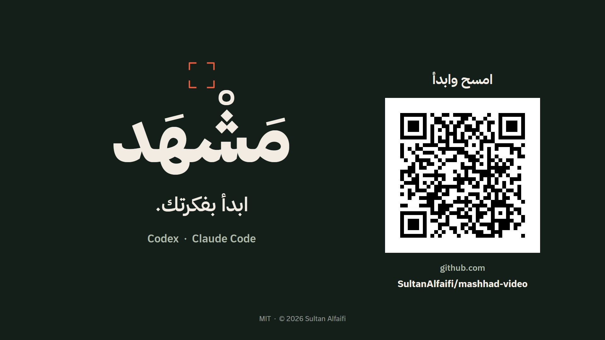

<div align="center">

# Mashhad

**From idea to finished motion design — an Agent Skill for Codex and Claude Code.**

[](docs/media/mashhad-ad-sfx-1080p.mp4)

[Watch the SFX demo](docs/media/mashhad-ad-sfx-1080p.mp4) · [Skill](skills/mashhad-video/SKILL.md) · [Credits and rights](THIRD_PARTY_NOTICES.md)

</div>

Mashhad brings creative direction, renderer selection, scene construction, audio coordination, and review into one portable skill. It selects a suitable production route and loads detailed guidance as needed. Video engines and external services are separate dependencies.

Documentation, instructions, and interface descriptions are written in English. Arabic text is retained only as intentional demo artwork and language-specific typography/test content.

- **A brief before production:** a few focused questions establish the purpose, visual direction, format, assets, and sound. Questions and creative work follow the user's language; repository instructions are in English.
- **Music-free by default:** transition effects, movement sounds, and nonmusical ambience, with recorded provenance or licensing. Music requires an explicit request.
- **Optional human-sounding AI narration:** the ElevenLabs route uses the actual recording to time scenes and keeps voice and effects in separate tracks.
- **Readable Arabic:** correct direction, connected lettering, clear diacritics, and a preference for locally available Thmanyah Sans.
- **One primary renderer:** Remotion, HyperFrames, Motion Canvas, or another suitable engine, with specialist tools where a shot benefits from them.
- **Reviewable delivery:** frame-based timing, explicit media handoffs, decoded-media checks, and clear separation between rendered, technically checked, and creatively reviewed results.
- **Portable instructions:** the same core works with Codex and Claude Code, including sequential execution without host-specific collaboration tools.

## What to expect

Mashhad provides a production workflow, not a guarantee of a professional result from an unspecified first prompt. The result depends on the brief, available assets and runtimes, creative decisions, and review of the rendered video. A strong result normally includes a short direction check, a representative preview, and refinement before the final render.

The linked public demo is the original **SFX-only** version. Its source is included. The later Haytham narration experiment is not part of that published demo or its reproducible source.

## Install

Python 3.10+ and Git are sufficient to copy the skill. These commands do not install a video engine, application, or paid service.

```sh
git clone https://github.com/SultanAlfaifi/mashhad-video.git
cd mashhad-video
python tools/install.py --agent both
```

Choose `--agent codex` or `--agent claude` to install for one host. For a project-local installation:

```sh
python tools/install.py --agent both --scope project --project /path/to/your/project
```

| Host | User installation | Invocation |
| --- | --- | --- |
| Codex | `~/.agents/skills/mashhad-video` | `$mashhad-video` |
| Claude Code | `~/.claude/skills/mashhad-video` | `/mashhad-video` |

The installer refuses to replace an existing skill. It recognizes an existing installation in the older Codex location, `~/.codex/skills`, to avoid duplication. Use `--dry-run` to inspect destinations, and preserve local customizations before replacing an installation. `agents/openai.yaml` is optional Codex interface metadata; the skill core is shared.

A local skills folder does not automatically transfer into a cloud Claude/Cowork environment. Enable the skill through that environment's supported skill management and confirm that execution tools are available. See the official [Claude Code documentation](https://code.claude.com/docs/en/skills) and [Codex documentation](https://developers.openai.com/codex/skills).

## Start with a short brief

Before writing the final script or building scenes, ask only about unresolved choices. Use the user's language, combine related questions, and avoid repeating information already supplied. Cover three to five topics as needed:

1. **Purpose and audience:** What should the viewer understand or do? Who is the video for, and what is the call to action?
2. **Delivery:** Where will it appear? What aspect ratio, duration, and output language are needed?
3. **Visual direction:** What mood and design style fit the brand? Is there a reference, or should Mashhad propose two or three concrete directions?
4. **Content and assets:** Is there approved copy, a logo, a product image, brand colors, or a required font? Which details must appear?
5. **Sound:** Should the video use effects only or human-sounding AI narration? If narrated, what language, accent, and energy should the voice have?

Summarize the agreed direction in a compact brief, identify any remaining assumptions, and proceed with the requested work. If the user has already provided a complete brief or asked Mashhad to choose, use those instructions without an unnecessary questionnaire.

## Example request

```text
Create a 20-second Arabic product ad for social media, using Thmanyah Sans.
Ask me about any missing audience, format, design, or content choices first.
Use an energetic, human-sounding Arabic AI voice and subtle transition effects,
with no music. Prefer Haytham through the ElevenLabs plugin.
Deliver the rendered video and editable source, and state which reviews passed.
```

## Narration with ElevenLabs

When the user wants human-sounding narration, use the [optional ElevenLabs route](skills/mashhad-video/references/elevenlabs-audio.md). This produces **AI-generated speech**, not a live human recording.

- Reuse an already connected ElevenLabs plugin or MCP connector.
- If no connection is available, ask the user to install and connect the ElevenLabs plugin through their host's supported setup. For Claude Code or another MCP client, use the official [hosted MCP connection guide](https://elevenlabs.io/docs/eleven-agents/operate/hosted-mcp). Continue independent planning while the connection is being set up.
- Do not ask for a separate API key when the connected plugin already provides the required tools. An independently built API application has its own setup requirements.
- For an **energetic Arabic advertisement**, the project owner's preferred starting voice is **Haytham – Conversation**, `IES4nrmZdUBHByLBde0P`, used in the later narration experiment. Check that this exact voice is available through the connection before generation. Honor a different user selection, and do not silently substitute another voice if Haytham is unavailable.
- Preview a short relevant passage when the voice has not already been accepted or its selection delegated. Reuse an accepted voice without another audition gate. Assess pronunciation, accent, pacing, and fit with the design; a voice name alone does not establish quality.

Write spoken copy separately from screen text. Measure the generated recording and phrase boundaries before setting final scene timing. Keep effects below the narration, preserve natural delivery, and leave enough time to read the link and scan the QR code. Narration remains optional and does not add music.

Tool availability, voices, and generation costs depend on the connected account. ElevenLabs is not bundled with this skill. The MIT licenses for Mashhad's instructions and the referenced [official ElevenLabs skills](https://github.com/elevenlabs/skills) do not automatically license generated audio; its usage rights follow the [service terms and plan used](https://help.elevenlabs.io/hc/en-us/articles/13313564601361-Can-I-publish-the-content-I-generate-on-the-platform).

## Thmanyah font

**Thmanyah Sans is supported and used in the demo, but font files are not included.** Each user must obtain a copy from [Thmanyah's official website](https://font.thmanyah.com/). Thmanyah owns the font; its [license](https://font.thmanyah.com/licenses) prohibits redistributing the files or hosting them for download. This project's MIT license does not cover the font.

Point `THMANYAH_FONT_DIR` to the local `thmanyahsans` directory or its parent directory. For example, in PowerShell:

```powershell
$env:THMANYAH_FONT_DIR = 'D:/Fonts/thmanyah typeface/thmanyahsans'
```

Weights: Regular 400, Medium 500, Bold 700, Black 900. See the [Arabic typography and audio guidance](skills/mashhad-video/references/arabic-and-audio.md).

## Included utilities

| Utility | Purpose |
| --- | --- |
| `inspect_environment.py` | Inspect available tools and dependencies without installing them |
| `project_manifest.py` | Validate scene coverage, overlaps, and frame timing |
| `media_check.py` | Check full decoding, exact frame count, dimensions, duration, audio, and transparency |

The utilities live in the [skill scripts directory](skills/mashhad-video/scripts). Media checks require FFmpeg and ffprobe. The [demo source](examples/mashhad-ad) uses HTML Canvas, Chromium, and FFmpeg. It contains the original procedural SFX generator and repository QR code, with no borrowed audio samples.

## Verification scope

The repository structure and links, timeline and media utilities, and a local demo render have been checked. The QR code was decoded from exported video frames. Claude Code compatibility is based on its documented Agent Skills format; an interactive Claude Code session has not been tested. Each specialist rendering route still needs verification in its target environment. Review records distinguish technical checks from visual inspection, listening, and user acceptance.

## Rights and acknowledgements

**Copyright © 2026 Sultan Alfaifi.** Original Mashhad files use the [MIT license](LICENSE). Retain the copyright and license notices when reusing them.

The instructions are original; external skill bodies and engines are not bundled into this package. Referenced projects, owners, and licenses are credited in [THIRD_PARTY_NOTICES.md](THIRD_PARTY_NOTICES.md) and [SOURCES.json](SOURCES.json). Their licenses and asset rights remain independent. No partnership or endorsement is implied. Nonmusical effects also need documented provenance or a valid license.
